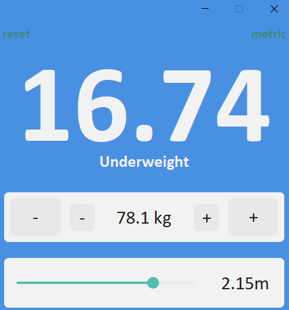
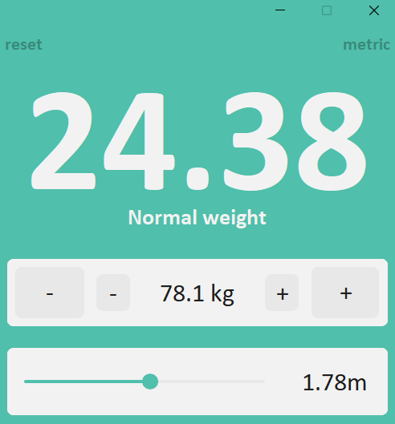
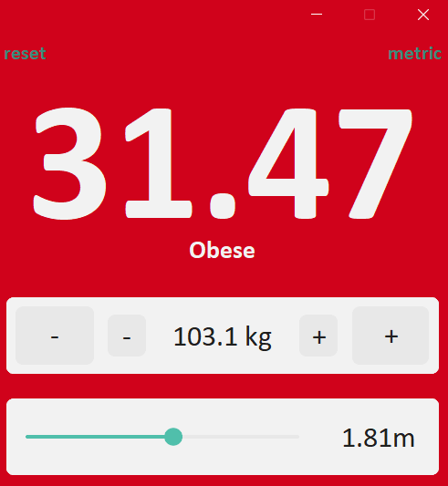

# BMI Calculator

A desktop BMI calculator with color-coded categories and unit switching, built with Python and CustomTkinter.

## Preview

| Underweight | Normal weight | Obese |
|:-:|:-:|:-:|
|  |  |  |

## Features

- Real-time BMI calculation as you change weight or height
- Color-coded background based on BMI category (underweight, normal, overweight, obese)
- BMI category label displayed under the BMI value
- Metric and imperial units (kg,cm and (lb/oz), (ft/in)) with one-click switch
- Weight controls with large (1 kg / 1 lb) and small (0.1 kg / 1 oz) buttons
- Height slider for quick adjustments
- Reset button to restore default values
- Window title bar matches the current BMI category color (does not work on Linux/Mac)

## How to use

1. Set your weight using the **+/-** buttons (large for 1 kg, small for 0.1 kg)
2. Set your height using the slider
3. The BMI value, category, and background color update automatically
4. Click **metric** in the top-right corner to switch between metric and imperial units
5. Click **reset** in the top-left corner to restore defaults (170 cm / 65 kg)

## BMI categories

| BMI range | Category | Color |
|-----------|----------|-------|
| < 18.5    | Underweight | Blue |
| 18.5 – 24.9 | Normal weight | Green |
| 25.0 – 29.9 | Overweight | Orange |
| ≥ 30.0    | Obese | Red |

## Project structure

```
02-bmi-calculator/
├── main.py             # Main application
├── settings.py         # Constants (colors, sizes, conversions)
├── screenshots/        # Screenshots used in README
│   ├── normal.png
│   ├── underweight.png
│   └── obese.png
└── README.md
```