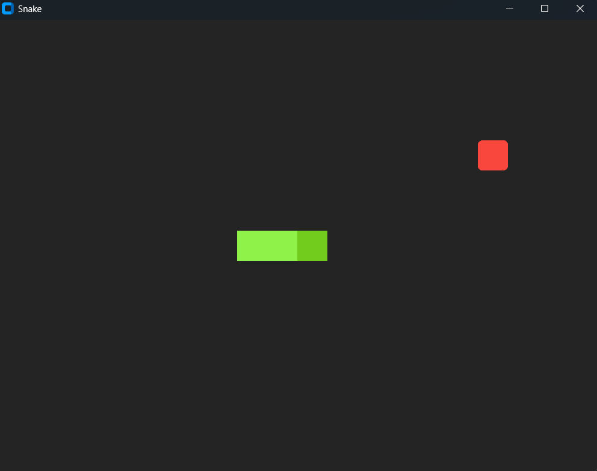
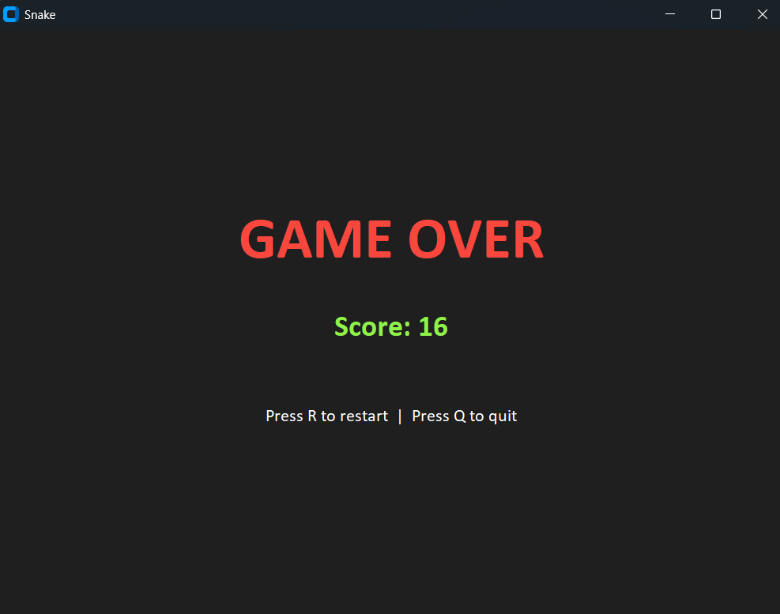

# Snake Game

A classic Snake game built with Python and CustomTkinter.

## Preview

| Gameplay | Game Over |
|:-:|:-:|
|  |  |

## Features

- Classic snake gameplay - eat apples, grow longer, avoid walls and yourself
- Arrow key controls, 180-degree turns are blocked
- Game Over screen with final score
- Restart with one key press, no need to relaunch
- Apples never appear on the snake

## How to play

1. Run the game and the snake starts moving right automatically
2. Use **arrow keys** to change direction
3. Eat red apples to grow longer and score points
4. Avoid hitting walls or your own body
5. On Game Over: press **R** to restart or **Q** to quit

## Controls

| Key | Action |
|-----|--------|
| **↑ ↓ ← →** | Move snake |
| **R** | Restart (after game over) |
| **Q** | Quit (after game over) |

## Project structure

```
03-snake-game/
├── main.py             # Main application and game loop
├── settings.py         # Constants (colors, sizes, game speed)
├── screenshots/        # Screenshots used in README
│   ├── gameplay.png
│   └── game_over.png
└── README.md
```