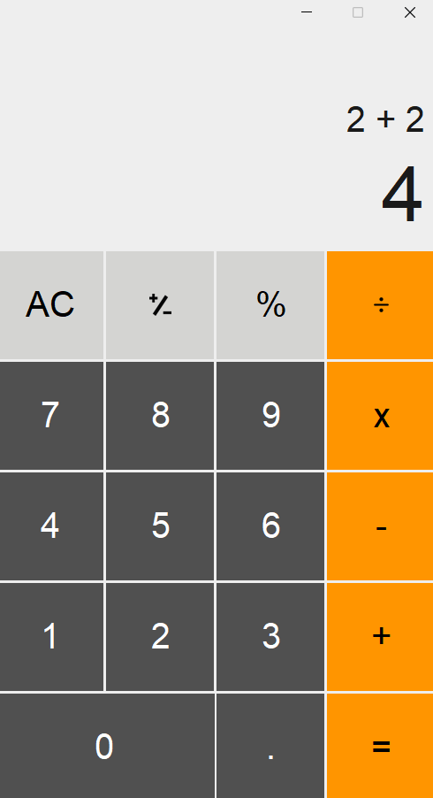
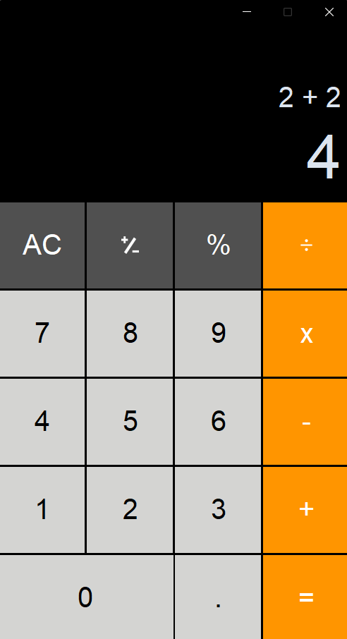

# Calculator

A desktop calculator with iOS-style design, automatic dark/light mode, and basic math operations.

## Preview

|         Light mode         | Dark mode |
|:--------------------------:|:-:|
|  |  |

## Funcionality

- Basic operations: addition, subtraction, multiplication, division
- Decimal numbers and percentage calculations
- Sign inversion (+/-)
- Clear button (AC)
- Formula display showing the full operation
- Automatic dark/light mode based on system theme
- Custom title bar color matching the theme (Windows 11)
- iOS-style button layout and colors

## Built with

- **CustomTkinter** – library built on top of Tkinter
- **Tkinter** – GUI library
- **Pillow (PIL)** – image processing for icons
- **darkdetect** – detect system dark/light mode
- **ctypes** – used to customize title bar color

## Buttons

| Button | Action |
|--------|--------|
| **0-9** | Enter a digit |
| **.** | Decimal point |
| **+** | Addition |
| **−** | Subtraction |
| **×** | Multiplication |
| **÷** | Division |
| **=** | Calculate result |
| **AC** | Clear everything |
| **%** | Convert current number to percentage |
| **+/-** | Toggle sign of current number |

## Project structure

```
04-calculator/
├── main.py             # Main application
├── buttons.py          # Custom button classes
├── settings.py         # Constants (colors, sizes, positions)
├── images/             # Button icons
│   ├── divide_dark.png
│   ├── divide_light.png
│   ├── invert_dark.png
│   └── invert_light.png
│   └── dark.png
│   └── light.png
└── README.md
```