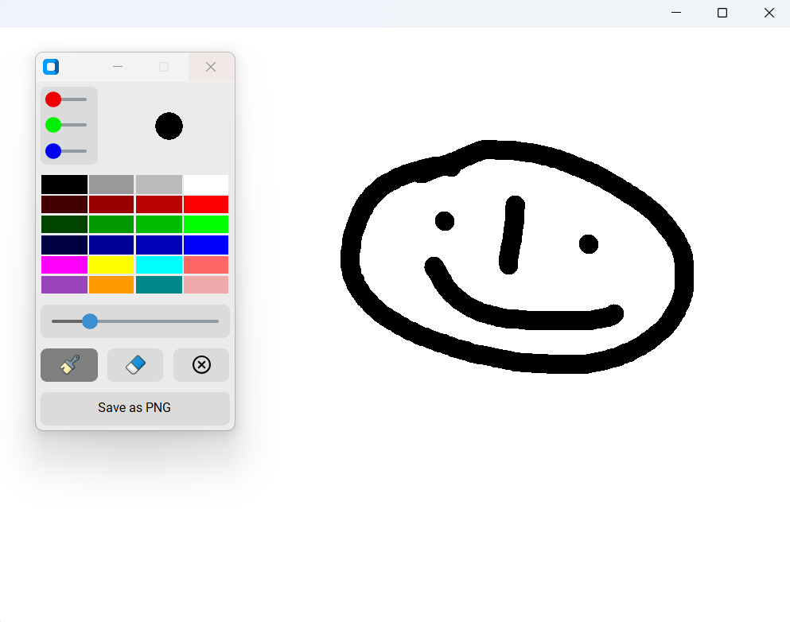

# Paint

A simple desktop paint application with brush, eraser, color picker, and PNG export, built with Python.

## Preview



## Features

- drawing on canvas
- color palette
- Custom color picker with RGB sliders
- Adjustable brush size
- Brush preview showing current color and size
- Eraser
- Clear canvas with one click
- Export drawing as PNG

## How to use

1. Pick a color from the palette or set custom RGB values with sliders
2. Adjust brush size with the slider or mouse wheel while hovering over the canvas
3. Click and drag on the canvas to draw
4. Use the eraser button to erase parts of your drawing
5. Click "clear" to wipe the canvas
6. Click "Save as PNG" to export your drawing to a file

## Controls

| Action | How |
|--------|-----|
| Draw | Click and drag on canvas |
| Pick color | Click any color in the palette |
| Custom color | Adjust RGB sliders |
| Change brush size | Brush slider or mouse wheel on canvas |
| Erase | Click eraser button |
| Clear canvas | Click clear button |
| Save drawing | Click "Save as PNG" |

## Project structure
```
06-paint/
├── main.py             # Main application window and canvas
├── drawing_area.py     # Canvas with drawing logic
├── tools.py            # Tool panel window with all controls
├── settings.py         # Constants (colors, sizes)
├── images/             # Icons for brush, eraser, clear buttons
│   ├── brush.png
│   ├── eraser.png
│   └── clear.png
├── screenshots/        # Screenshots used in README
│   └── main_window.png
└── README.md
```